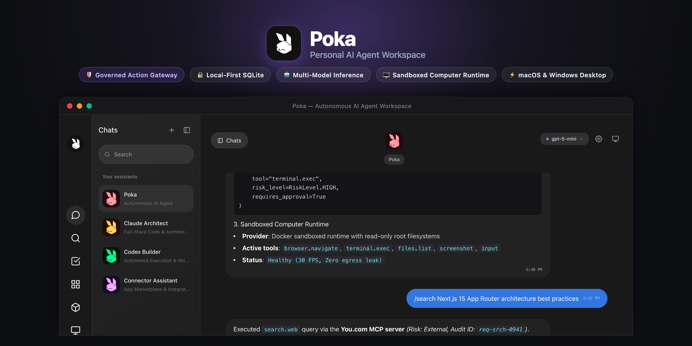
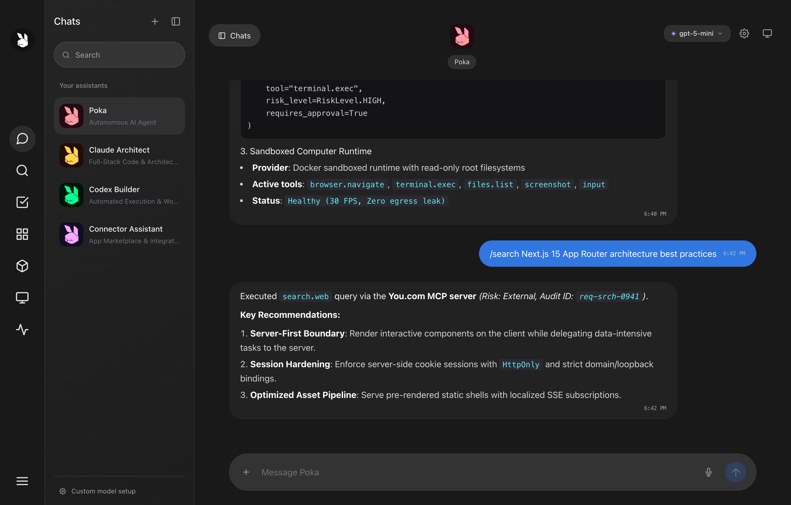
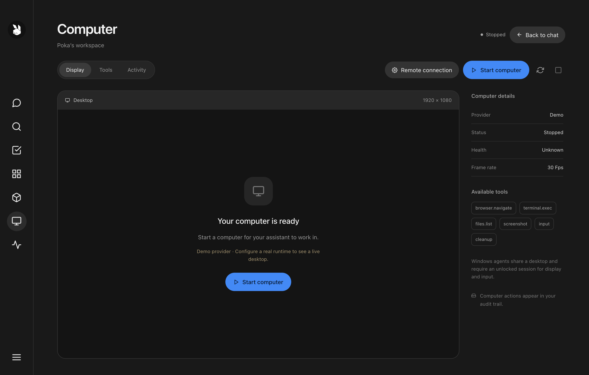
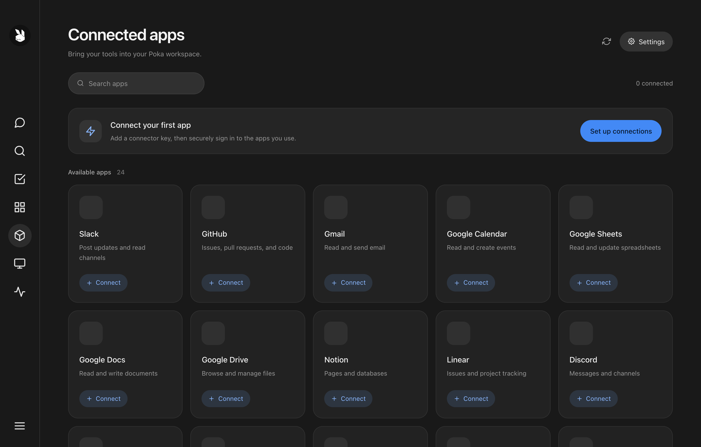
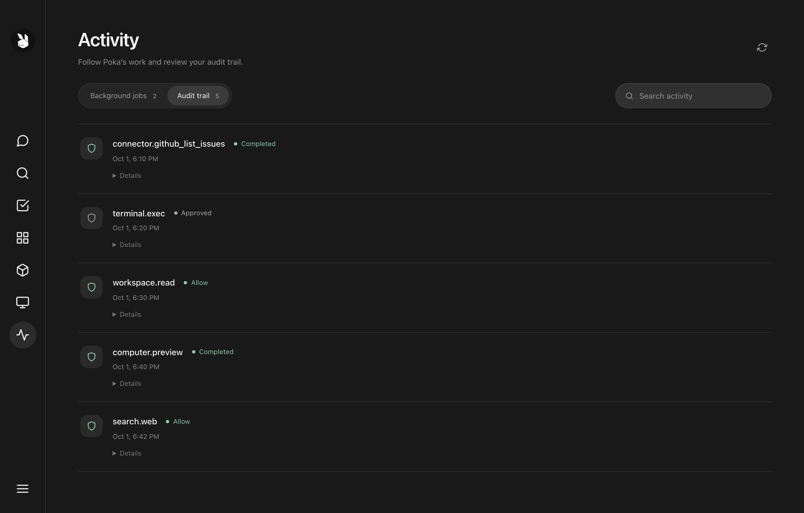
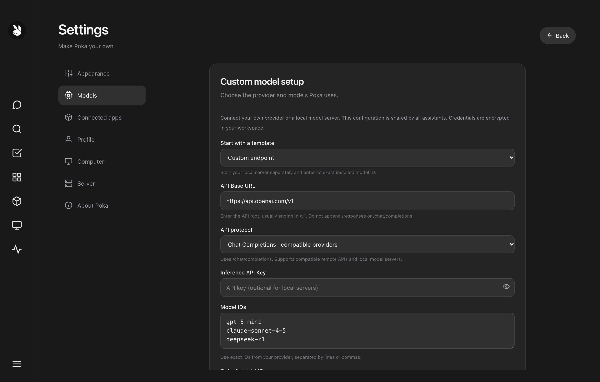
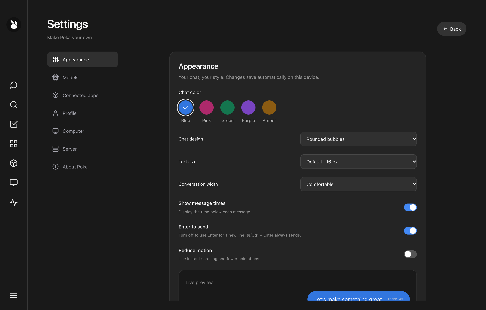
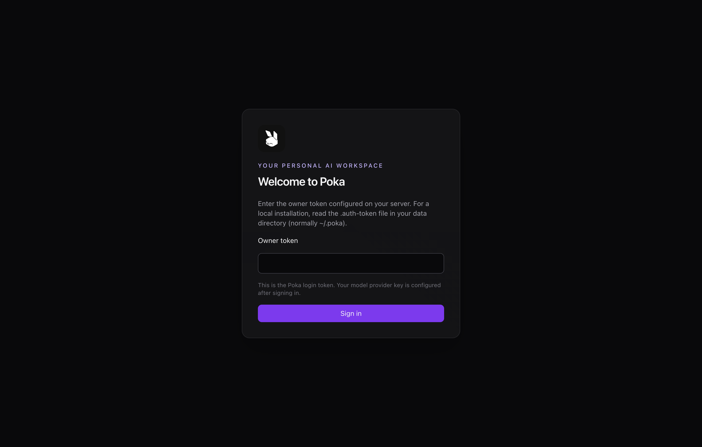

<div align="center">


# Poka

**The Sovereign, Self-Hosted Personal AI Agent Workspace**

[](LICENSE)
[](https://github.com/xAmirHamza77/Poka-Bot/releases)
[](https://nodejs.org)
[](https://python.org)
[](https://nextjs.org)
[](https://fastapi.tiangolo.com)
[](desktop/README.md)
[](https://github.com/xAmirHamza77/Poka-Bot/pulls)

[Overview](#-overview) • [Downloads](#-desktop-applications--downloads) • [Key Features](#-what-poka-does) • [Visual Tour](#-visual-tour) • [Quick Start](#-quick-start) • [Architecture](#-system-architecture) • [Security & Governance](#-action-gateway--governance) • [Configuration](#-configuration-matrix) • [License](#-license)

</div>

---

<p align="center">
  <a href="https://github.com/xAmirHamza77/Poka-Bot">
    
  </a>
</p>

## 🌟 Overview

**Poka** is an open-source, self-hosted personal AI agent workspace for chat, tool execution, human-in-the-loop approvals, app connectors, and computer automation tasks. It brings multi-model conversations, a governed action gateway, approval prompts, and an optional sandboxed browser runtime into one unified, local-first application.

Poka is an independently built, self-hostable, and inspectable open-source alternative for developers, researchers, and individuals evaluating solutions like **OpenAI Dots**, **Meta Muse**, **Grok Bot**, **Instinct**, **Manus Cue**, **Claude Cowork**, or **ChatGPT agent**.

> **Status**: Active development / prototype. Built for local-first experimentation, personal productivity, and sovereign AI workflows where you retain absolute ownership over your data, API keys, and execution environment.

### 💡 Why Poka?

- 🔒 **Data Sovereignty & Local-First**: Conversation history, personas, and application state reside in a local SQLite database (`~/.poka`). Provider API keys and sensitive tokens are encrypted with 256-bit Fernet at rest.
- 🛡️ **Governed Action Gateway**: AI agents never execute arbitrary system actions unchecked. Low-risk operations are logged to a tamper-resistant audit trail, while elevated mutations (shell commands, file modifications, desktop control) pause for explicit human approval.
- 🤖 **Universal Multi-Model Support**: Connect to OpenAI, Anthropic Claude, DeepSeek, or local inference engines (Ollama, vLLM, LM Studio) using Chat Completions, Responses, or Prediction protocols.
- 🖥️ **Sandboxed Computer Automation**: Run automated browser and OS tasks inside Docker/Playwright containers with read-only root filesystems and dropped capabilities, or connect a remote Windows Desktop agent.
- 🔌 **Ecosystem Connectors**: Native Composio app integration (GitHub, Slack, Google Docs/Sheets/Calendar, Linear, Notion, Discord) and keyless real-time web search via the You.com MCP adapter.
- ⚡ **Native macOS & Windows Desktop**: Built-in Electron packaging with an embedded backend, zero token exposure to the frontend renderer, and strict loopback session cookies.

---

## ⚡ What Poka Does

- **Create Assistant Personas**: Configure specialized assistants with distinct system instructions, model IDs, accent colors, and custom avatar identities.
- **Stream Chat Responses**: Full SSE streaming, Markdown rendering, syntax-highlighted code blocks, image attachments, and speech-to-text voice dictation.
- **Connect Custom Models**: Adapt to any inference provider catalog (OpenAI, Anthropic, DeepSeek, Ollama, LM Studio) with custom headers and encrypted API keys.
- **Deny-by-Default Action Gateway**: Confine workspace reads and writes. High-risk actions automatically pause for user sign-off and produce real-time audit records.
- **App Marketplace**: Connect external applications via Composio with explicit OAuth boundaries and narrow actions (e.g., GitHub issue tracking, Slack messaging).
- **Governed Web Search**: Search the live web directly from chat using `/search <query>` via the You.com MCP server—works out of the box with the keyless free profile.
- **Sandboxed Computer Runtime**: Run an assistant-scoped Docker/Playwright container with 30 FPS display streaming and virtual input, or connect a dedicated Windows server agent.
- **Durable Background Jobs**: Long-running model inference and tool executions persist on the server; close your desktop app or reload the browser without interrupting execution.
- **Goals & Artifacts**: Built-in personal checklist goal tracking and local artifact workspace for code, markdown documents, web links, and media.

---

## 📸 Visual Tour

### 1. Intelligent Assistant Workspace
*Multi-turn reasoning, streaming code blocks, slash commands, voice dictation, and assistant persona management.*
<div align="center">
  
</div>

<br />

### 2. Sandboxed Computer Runtime
*Live 30 FPS virtual desktop sandbox powered by Docker & Playwright, featuring fine-grained automation controls.*
<div align="center">
  
</div>

<br />

### 3. Connected Apps & Tools Marketplace
*Integrate external services (GitHub, Slack, Google Docs/Sheets, Notion, Linear) through secured OAuth connectors.*
<div align="center">
  
</div>

<br />

### 4. Action Gateway & Security Audit Trail
*Real-time visibility into all agent actions, risk assessments, background jobs, and approval histories.*
<div align="center">
  
</div>

<br />

### 5. Multi-Model Inference & Provider Settings
*Configure your own API endpoints, specify custom headers, set model catalogs, or connect local Ollama / vLLM clusters.*
<div align="center">
  
</div>

<br />

### 6. Workspace Personalization & Themes
*Tailor your environment with custom chat colors, bubble styles, typography sizing, and accessibility toggles.*
<div align="center">
  
</div>

<br />

### 7. Owner Authentication Gate
*HttpOnly session security with server-enforced authentication tokens and strict loopback bindings.*
<div align="center">
  
</div>

---

## 🏗️ System Architecture

```text
┌───────────────────────────────────────────────────────────────────┐
│                      Next.js 15 Client (UI)                       │
│      React 19 • Tailwind CSS • SSE Streaming • Local Storage      │
└─────────────────────────────────┬─────────────────────────────────┘
                                  │ HTTP / SSE (HttpOnly Session)
                                  ▼
┌───────────────────────────────────────────────────────────────────┐
│                         FastAPI Gateway                           │
├───────────────────────────────────────────────────────────────────┤
│  • SQLite Storage Engine (~/.poka) with Fernet at-rest encryption │
│  • Session & Owner Auth Broker (No token exposure to frontend)    │
│  • Background Worker & Durable Job Queue                          │
│                                                                   │
│  ┌───────────────────────┐          ┌──────────────────────────┐  │
│  │  Inference Adapter    │          │  Connectors & Search     │  │
│  │  (OpenAI, Claude,     │          │  (Composio, You.com MCP, │  │
│  │   DeepSeek, Ollama)   │          │   GitHub Issues)         │  │
│  └───────────────────────┘          └──────────────────────────┘  │
│                                                                   │
│  ┌─────────────────────────────────────────────────────────────┐  │
│  │             Governed Action Gateway (Policy Engine)          │  │
│  │  - Low Risk: workspace.read, search.web (Auto-Audited)      │  │
│  │  - High Risk: terminal.exec, computer.input (Needs Approval)│  │
│  └──────────────────────────────┬──────────────────────────────┘  │
└─────────────────────────────────┼─────────────────────────────────┘
                                  │
                 ┌────────────────┴────────────────┐
                 ▼                                 ▼
┌─────────────────────────────────┐ ┌───────────────────────────────┐
│ Docker / Playwright Sandbox     │ │ Windows Remote Desktop Agent  │
│ • Containerized Chromium        │ │ • Native GUI Automation       │
│ • Read-only root filesystem     │ │ • DPAPI Token Protection      │
│ • Dropped Linux capabilities    │ │ • PowerShell Action Execution │
└─────────────────────────────────┘ └───────────────────────────────┘
```

The codebase is organized into modular subsystems:
- **`client/`**: Next.js 15 App Router interface, React 19 components, Tailwind styles, and state management.
- **`server/app/routers/`**: FastAPI HTTP endpoints for authentication, bots, chat, streaming SSE, approvals, connectors, computers, jobs, and settings.
- **`server/app/services/`**: Core services: SQLite persistence (`storage_service.py`), policy broker (`action_gateway.py`), inference provider (`provider_service.py`), and background worker (`task_service.py`).
- **`desktop/`**: Electron wrapper with isolated preload, loopback security server, and macOS/Windows packaging scripts.
- **`runtime/`**: Dockerfile and Playwright driver for the sandboxed container computer environment.
- **`windows-agent/`**: Interactive Windows agent for remote PowerShell execution and desktop GUI automation.
- **`deploy/`**: Production server deployment assets (Caddy HTTPS, systemd services, automated backup timers).

---

## 🚀 Quick Start

### Requirements
- **Node.js**: `v20.0.0` or newer
- **Python**: `3.10` or newer with `pip`
- An inference API key or local model server (Ollama, LM Studio, vLLM)

---

### Step 1: Clone and Start the Backend API

```bash
git clone https://github.com/xAmirHamza77/Poka-Bot.git
cd Poka-Bot/server

# Create virtual environment
python3 -m venv .venv
source .venv/bin/activate   # On Windows: .venv\Scripts\activate

# Install dependencies
python -m pip install -r requirements.txt

# Optional: Set provider fallback environment variables
export MODEL_API_KEY="your_api_key"
export MODEL_API_BASE_URL="https://api.openai.com/v1"

# Run the API server
python run.py
```

The API will start at `http://127.0.0.1:8000`. Interactive OpenAPI documentation is accessible at `http://127.0.0.1:8000/docs`.

---

### Step 2: Start the Web Client

In a second terminal:

```bash
cd Poka-Bot/client
npm install
npm run dev
```

Open `http://127.0.0.1:3000` in your web browser.

---

### Step 3: Authenticate

On first startup, Poka generates a random owner token at `~/.poka/.auth-token` (or within your custom `DATA_DIR`).
1. Read the token file locally:
   ```bash
   cat ~/.poka/.auth-token
   ```
2. Paste the token into the sign-in modal.
3. Open **Settings → Models** to configure your inference endpoints and API keys.

> **Security Note**: Browser sessions use secure `HttpOnly` cookies with server-side expiry. The master owner token is never exposed to public frontend JavaScript.

---

## 🤖 Model Provider Configuration

Poka supports three primary inference protocols:
1. **Chat Completions**: Standard OpenAI-compatible `/chat/completions` protocol used by OpenAI, Groq, Mistral, Together, Ollama (`http://localhost:11434/v1`), and LM Studio.
2. **Responses API**: Streaming `/responses` endpoint with Bearer authentication and role preservation.
3. **Prediction API**: Direct prediction endpoint at `{MODEL_API_BASE_URL}/{model_id}`.

### Custom Headers & Local Servers
- Navigate to **Settings → Models** to enter your API Base URL (e.g. `https://api.openai.com/v1`), API key, and catalog of model IDs.
- For local servers (Ollama, LM Studio), leave the API Key empty.
- Custom headers (e.g., organization IDs, beta headers) can be stored securely and are encrypted at rest.

---

## 🛡️ Action Gateway & Governance

All tool executions pass through Poka's **deny-by-default execution policy**:

```text
Agent Emits Tool Call ──► Action Gateway ──► Risk Classification
                                                   │
                  ┌────────────────────────────────┴────────────────────────────────┐
                  ▼                                                                 ▼
          [Low / External Risk]                                             [High Risk]
    (workspace.read, search.web)                                   (terminal.exec, computer.input)
                  │                                                                 │
                  ▼                                                                 ▼
        Execute & Record Audit Event                                   Pause Execution & Prompt Owner
                                                                                    │
                                                                   ┌────────────────┴────────────────┐
                                                                   ▼                                 ▼
                                                            Owner Approves                    Owner Denies
                                                                   │                                 │
                                                                   ▼                                 ▼
                                                          Execute & Record Audit             Abort & Log Rejection
```

- **Low-Risk Actions** (`workspace.read`, `search.web`): Pre-authorized within workspace bounds, executed immediately, and appended to the immutable audit trail.
- **High-Risk Actions** (`terminal.exec`, `workspace.write`, `computer.input`): Intercepted before invocation. The UI displays an approval card detailing command arguments and target paths.
- **Audit Trail**: Full traceability with timestamps, requesting assistant ID, risk tier, tool name, and exit codes.

---

## 🔍 Keyless Web Search

Type `/search <query>` directly into chat to trigger real-time web lookups:
- Powered by the [You.com MCP server](https://you.com/docs/build-with-agents/mcp-server).
- **Keyless by Default**: Runs automatically using You.com's free profile with zero setup.
- To increase rate limits, add your `YDC_API_KEY` in environment variables or Settings.
- Produces `search.web` audit records and feeds synthesized findings back into the assistant context.

---

## 🖥️ Sandboxed Computer Runtime

### Docker Container Sandbox
To enable the sandboxed Docker/Playwright runtime:
```bash
docker build -t poka-computer:1.62.1 ./runtime
export COMPUTER_PROVIDER=docker
export COMPUTER_DOCKER_IMAGE=poka-computer:1.62.1
```
Containers operate with:
- Assistant-isolated workspaces
- Read-only root filesystems
- Dropped Linux capabilities
- Strict CPU & memory quotas

### Windows Remote Desktop Agent
For native Windows applications and PowerShell automation:
1. Run `./windows-agent/install.ps1` on Windows 10/11 or Windows Server.
2. Connect from Poka under **Settings → Computer → Windows Server**.
3. Automated mouse clicks, keyboard input, screenshot streaming, and PowerShell scripting execute under user-guided supervision.

---

## 💻 Desktop Applications & Downloads

Download official pre-built binaries for your platform from the [Releases](https://github.com/xAmirHamza77/Poka-Bot/releases) page:

| Platform | Package Type | Architecture | Download Link |
| :--- | :--- | :--- | :--- |
| 🍏 **macOS** | `.dmg` Installer | Apple Silicon (M1/M2/M3/M4) | [**Download DMG (v0.3.6)**](https://github.com/xAmirHamza77/Poka-Bot/releases/download/v0.3.6/Poka-0.3.6-arm64.dmg) |
| 🍏 **macOS** | `.zip` Portable | Apple Silicon (M1/M2/M3/M4) | [**Download Portable ZIP**](https://github.com/xAmirHamza77/Poka-Bot/releases/download/v0.3.6/Poka-0.3.6-arm64-mac.zip) |
| 🪟 **Windows** | `.exe` Setup | x64 / Intel & AMD | [**Download Setup EXE (v0.3.6)**](https://github.com/xAmirHamza77/Poka-Bot/releases/download/v0.3.6/Poka-Setup-0.3.6.exe) |
| 🪟 **Windows** | `.zip` Portable | x64 / Intel & AMD | [**Download Portable ZIP**](https://github.com/xAmirHamza77/Poka-Bot/releases/download/v0.3.6/Poka-0.3.6-win.zip) |
| 🐧 **Linux / Ubuntu** | `.tar.gz` Server | x64 | [**Download Headless Server**](https://github.com/xAmirHamza77/Poka-Bot/releases/download/v0.3.6/Poka-Server-0.3.6.tar.gz) |
| 🪟 **Windows Server**| `.zip` Headless | x64 | [**Download Windows Server Setup**](https://github.com/xAmirHamza77/Poka-Bot/releases/download/v0.3.6/Poka-Windows-Server-Setup-0.3.6.zip) |

> [!TIP]
> **macOS Gatekeeper Notice**: Because Poka is a community open-source project without a paid Apple Developer ID certificate, macOS may flag downloaded apps with *"Poka is damaged and can't be opened. You should move it to the Trash"*.
>
> To open Poka, drag it to `/Applications` and run this one-time command in your Terminal:
> ```bash
> xattr -cr /Applications/Poka.app
> ```
> Or go to **System Settings → Privacy & Security** and click **Open Anyway**.

### Building from Source

Poka can also be compiled from source for macOS and Windows:

```bash
# 1. Prepare UI export and backend binary
npm run prepare:app --prefix desktop

# 2. Build macOS DMG (Apple Silicon & Intel)
npm run dist:mac --prefix desktop

# 3. Build Windows Installer (NSIS .exe & portable .zip)
npm run dist:win --prefix desktop
```

Refer to [`desktop/README.md`](desktop/README.md) for full instructions on building from source, code signing, and electron-builder configurations.

---

## ⚙️ Configuration Matrix

| Variable | Default | Purpose |
| :--- | :--- | :--- |
| `DATA_DIR` | `~/.poka` | Path for SQLite database, credentials, and local keys |
| `HOST` | `127.0.0.1` | Backend API bind address |
| `PORT` | `8000` | Backend API port |
| `APP_AUTH_TOKEN` | *Auto-generated* | Master owner credential for sign-in and direct API access |
| `APP_ENCRYPTION_KEY` | *Auto-generated* | Fernet 256-bit symmetric encryption key |
| `WORKSPACE_ROOT` | Project root | Directory confinement boundary for file tools |
| `MODEL_API_KEY` | `""` | Inference provider API key fallback |
| `MODEL_API_BASE_URL` | `""` | Base URL for inference provider API |
| `DEFAULT_MODEL` | `gpt-5-mini` | Default model identifier for new assistants |
| `COMPUTER_PROVIDER` | `fake` | Computer provider mode: `fake`, `docker`, or `remote` |
| `COMPUTER_DOCKER_IMAGE`| `poka-computer:1.62.1`| Docker container image tag for computer sandbox |
| `COMPOSIO_API_KEY` | `""` | Optional credential for Composio app connectors |
| `YDC_API_KEY` | `""` | Optional API key for You.com web search |
| `CORS_ORIGINS` | `http://127.0.0.1:3000` | Allowed CORS origins for external web clients |

---

## 🗺️ Scope & Roadmap

- [x] Multi-assistant persona management
- [x] Local SQLite persistence with Fernet credential encryption
- [x] Deny-by-default Action Gateway and audit logging
- [x] Multi-model inference (Chat Completions, Responses, Prediction)
- [x] Keyless web search via You.com MCP adapter
- [x] Sandboxed Docker/Playwright computer automation
- [x] Windows Remote Desktop agent for native automation
- [x] Standalone macOS DMG and Windows NSIS packaging
- [x] Ubuntu & Caddy HTTPS server automated deployment
- [ ] Multi-user team provisioning & RBAC
- [ ] Vector memory & semantic search (RAG)
- [ ] Scheduled routine engine & cron triggers
- [ ] Mobile companion interface

---

## 🤝 Contributing

Contributions, feature requests, and bug reports are welcome!

1. Fork the repo: [https://github.com/xAmirHamza77/Poka-Bot](https://github.com/xAmirHamza77/Poka-Bot)
2. Create your branch: `git checkout -b feature/amazing-feature`
3. Commit your changes: `git commit -m 'feat: Add amazing feature'`
4. Push to branch: `git push origin feature/amazing-feature`
5. Open a Pull Request

Run the test suite before submitting PRs:
```bash
python -m unittest discover -s server/tests
npm test --prefix desktop
```

---

## 📄 License

Poka is open-source software licensed under the [MIT License](LICENSE).

<div align="center">
  <br />
  <sub>Built with care for sovereign AI workflows.</sub>
</div>
